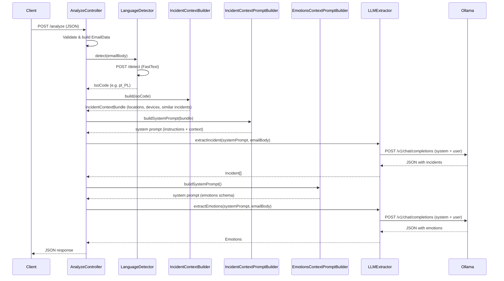

# AI Email Analyzer (Proof of Concept)

> **This is a Proof of Concept.** Not intended for production use.

AI-powered email analysis system that detects language, extracts device incidents, and analyzes emotional tone of incoming maintenance emails.

## Architecture

The system runs as a set of Docker containers orchestrated with Docker Compose, using **Traefik v3.0** as a reverse proxy.

### Services

| Service | Tech | Host | Description |
|---|---|---|---|
| **email-service** | PHP 8.5 / Symfony 8.0 | `email.localhost` | Core API — accepts emails and returns analysis results |
| **language-detector** | Python / FastAPI / FastText | `language.localhost` | Language identification microservice using FastText `lid.176.bin` model |
| **ollama** | Ollama / llama3.1:8b | (internal) | LLM for incident extraction and emotion analysis |
| **traefik** | Traefik v3.0 | `localhost:80` | Reverse proxy, dashboard at `localhost:8088` |

### Analysis flow (`POST /analyze`)



## Quick start

```bash
make up        # start containers
make init      # install dependencies
make sh        # shell into email-service
make down      # stop containers
```

## Configuration

Environment variables (`.env`):

| Variable | Default | Description |
|---|---|---|
| `LANGUAGE_DETECTOR_URL` | `http://language-detector:8090` | Language detection service URL |
| `OLLAMA_URL` | `http://ollama:11434` | Ollama LLM service URL |
| `OLLAMA_MODEL` | `llama3.1:8b` | LLM model name |
| `OLLAMA_TEMPERATURE_INCIDENT` | `0.1` | Temperature for incident extraction |
| `OLLAMA_TEMPERATURE_EMOTIONS` | `0.4` | Temperature for emotion analysis |
| `LANGUAGE_DETECTOR_CONFIDENCE_THRESHOLD` | `0.5` | Minimum confidence for language detection |

## API

### Analyze email

```
POST http://email.localhost/analyze
Content-Type: application/json
```

**Request:**
```json
{
  "received_at": "2026-03-13",
  "from": "sender@example.com",
  "to": "recipient@example.com",
  "subject": "Example subject",
  "body": "Email body text to analyze."
}
```

**Response:**
```json
{
  "received_at": "2026-03-13",
  "from": "sender@example.com",
  "to": "recipient@example.com",
  "subject": "Example subject",
  "language": "pl_PL",
  "incidents": [
    {
      "device_type": "EN57",
      "device_id": "1234",
      "location": "Kraków Główny",
      "symptom": "device stopped",
      "priority": "critical"
    }
  ],
  "emotions": {
    "sentiment": "negative",
    "emotions": ["frustration"],
    "intensity": 70,
    "explanation": "The text expresses frustration..."
  }
}
```

### Detect language

```
POST http://language.localhost/detect
Content-Type: application/json
```

```json
{
  "text": "Text to identify."
}
```
