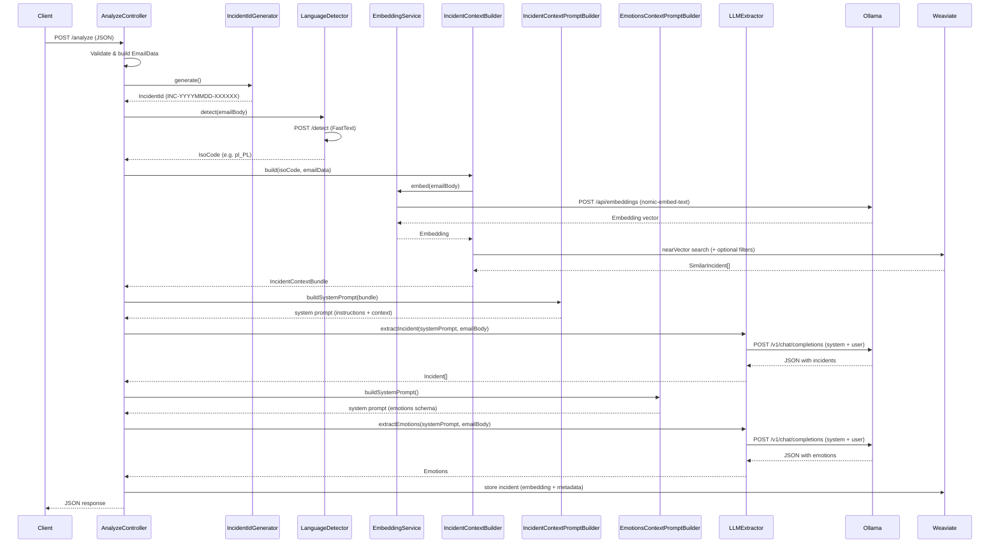

# AI Email Analyzer (Proof of Concept)

> **This is a Proof of Concept.** Not intended for production use.

AI-powered email analysis system that detects language, extracts device incidents, and analyzes emotional tone of incoming maintenance emails. Incidents are stored in Weaviate vector database for similarity search.

## Architecture

The system runs as a set of Docker containers orchestrated with Docker Compose, using **Traefik v3.x** as a reverse proxy.

### Services

| Service            | Tech                        | Host | Description |
|--------------------|-----------------------------|---|---|
| **email-service**  | PHP 8.5 / Symfony 8.0       | `email.localhost` | Core API — accepts emails and returns analysis results |
| **language-detector** | Python / FastAPI / FastText | `language.localhost` | Language identification microservice using FastText `lid.176.bin` model |
| **embedding-service** | Python / FastAPI            | `embedding.localhost` | Embedding proxy + Weaviate schema management scripts |
| **ollama**         | Ollama / llama3.1:8b        | `llm.localhost` | LLM for incident extraction, emotion analysis and embeddings |
| **weaviate**       | Weaviate                    | (internal) | Vector database for storing and searching similar incidents |
| **traefik**        | Traefik v3.x                | `localhost:80` | Reverse proxy, dashboard at `localhost:8088` |

### Analysis flow (`POST /analyze`)



## Quick start

```bash
make up        # start containers
make init      # install dependencies
make sh        # shell into email-service
make down      # stop containers
```

### Weaviate schema management

```bash
docker compose exec embedding-service python bootstrap.py          # create schema
docker compose exec embedding-service python list.py               # list all schemas
docker compose exec embedding-service python describe.py Incident  # describe schema
docker compose exec embedding-service python delete.py Incident    # delete schema
```

## Configuration

Environment variables (`email-service/.env`):

| Variable | Default | Description |
|---|---|---|
| `LANGUAGE_DETECTOR_URL` | `http://language-detector:8090` | Language detection service URL |
| `LANGUAGE_DETECTOR_CONFIDENCE_THRESHOLD` | `0.5` | Minimum confidence for language detection |
| `OLLAMA_URL` | `http://ollama:11434` | Ollama LLM service URL |
| `OLLAMA_MODEL` | `llama3.1:8b` | LLM model name |
| `OLLAMA_TEMPERATURE_INCIDENT` | `0.1` | Temperature for incident extraction |
| `OLLAMA_TEMPERATURE_EMOTIONS` | `0.4` | Temperature for emotion analysis |
| `OLLAMA_EMBEDDING_MODEL` | `nomic-embed-text` | Embedding model name |
| `WEAVIATE_URL` | `http://weaviate:8080` | Weaviate vector database URL |
| `WEAVIATE_SIMILAR_INCIDENT_LIMIT` | `5` | Max similar incidents returned |

## API

### Analyze email

```
POST http://email.localhost/analyze
Content-Type: application/json
```

**Request:**
```json
{
  "received_at": "2026-03-13",
  "from": "sender@example.com",
  "to": "recipient@example.com",
  "subject": "Example subject",
  "body": "Email body text to analyze."
}
```

**Response:**
```json
{
  "incident_id": "INC-20260313-000001",
  "received_at": "2026-03-13",
  "from": "sender@example.com",
  "to": "recipient@example.com",
  "subject": "Example subject",
  "language": "pl_PL",
  "incidents": [
    {
      "device_type": "EN57",
      "device_id": "1234",
      "location": "Kraków Główny",
      "symptom": "device stopped",
      "priority": "critical"
    }
  ],
  "emotions": {
    "sentiment": "negative",
    "emotions": ["frustration"],
    "intensity": 70,
    "explanation": "The text expresses frustration..."
  }
}
```
